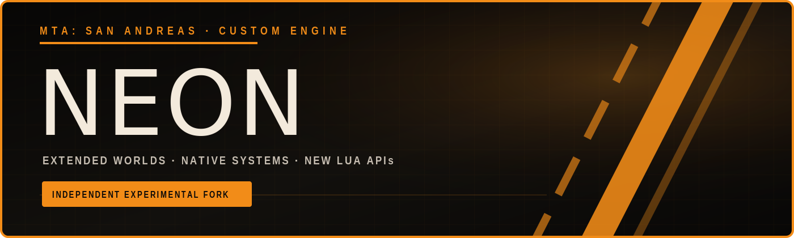
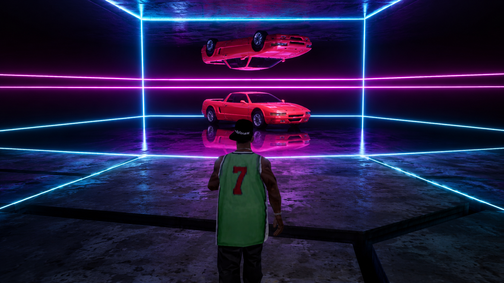

<p align="center">
  <a href="https://mtasa-neon-wiki.vercel.app/neon"></a>
</p>

<p align="center">
  <a href="https://mtasa-neon-wiki.vercel.app/neon"></a>
</p>

<p align="center"><strong>New to Neon? Start with the documentation, feature guides, and complete Lua API.</strong></p>

<p align="center">
  <a href="https://discord.com/invite/mgFRd2AzF8"></a>
  <a href="https://github.com/multitheftauto/mtasa-blue"></a>
</p>

<p align="center"><strong>An independent MTA:BLUE-derived playground for deeper GTA:SA engine work.</strong></p>

MTA:SA Neon is an experimental fork of [Multi Theft Auto: San Andreas](https://github.com/multitheftauto/mtasa-blue), focused on prototyping advanced engine features and exploring changes that may be too early or too specialized for the upstream project.

The repository preserves the complete upstream history and adds proof-of-concept work on top of it. Neon is not affiliated with or endorsed by the Multi Theft Auto team.

Readers familiar with the historical [MTA:Eir](https://wiki.multitheftauto.com/wiki/MTA:Eir) project may recognize a related ambition: using an independent MTA:BLUE-derived codebase as a laboratory for deeper GTA:SA engine integration, expanded streaming and IMG workflows, reverse-engineered native features, and new scripting APIs. Neon is not a continuation of or affiliated with MTA:Eir; the comparison is about scope and experimental spirit.

## MTA:SA vs MTA:SA Neon

Neon keeps MTA:SA's resource model and default gameplay behavior while lifting selected GTA:SA engine limits and exposing new opt-in features to resources. The figures below describe the currently implemented Neon client/server patches and resource workflows.

| Area | MTA:SA | MTA:SA Neon |
| --- | ---: | ---: |
| GTA corona pool | 64 | 4,096 (4,094 available to scripted MTA coronas) |
| GTA 3D marker pool | 32 | 4,096 |
| GTA checkpoint pool | 32 | 4,096 |
| GTA checkpoint direction arrows | 5 | 4,096 |
| GTA attribute CULL zones | 1,300 | 4,096 |
| GTA tunnel CULL zones | 40 | 256 |
| GTA mirror CULL zones | 72 | 256 |
| Native CULL-zone editing | Not exposed to Lua | Client Lua CRUD with stable IDs, resource-scoped cleanup, and 3D diagnostics |
| Visible entity pointers | 1,000 | 8,192 |
| Visible LOD pointers | 1,000 | 8,192 |
| Streaming RenderWare object instances | 2,500 | 30,000 |
| Main world-sector grid | 120 x 120 | 400 x 400 |
| LOD world-sector grid | 30 x 30 | 100 x 100 |
| Supported extended-world XY | Approximately -3,000 to +3,000 | -10,000 to +9,999 |
| Native minimap tiles | Fixed 12 x 12 stock grid, approximately -3,000 to +3,000 | Sparse 40 x 40 logical grid covering -10,000 to +9,999, with resource-owned TXDs and protected stock tiles |
| Extended F11 world map | Packaged San Andreas map | Dynamic atlas composed from GTA's native tiles and registered extended tiles, with catalog-derived world bounds |
| Large IMG-backed map residency | Basic client-side IMG linking | Resource-managed per-client residency for large map packs, with bounded model/TXD allocation, scene preloading, teardown-safe slot reuse, and optional switching |
| MTA pickup visual XY | -4,096 to +4,095.875 | -10,000 to +9,999 |
| Low-precision networked XY | Approximately -8,192 to +8,192 | -10,000 to +10,000 for Neon-capable connections |
| Absolute networked camera range | Approximately -8,192 to +8,192 | Approximately -16,384 to +16,384 for Neon-capable connections |
| Custom-water block grid | 12 x 12 (144 blocks) | 40 x 40 (1,600 blocks) |
| Custom-water XY | Approximately -3,000 to +3,000 | -10,000 to +9,999 |
| Procedural seabed boundary | Unlimited | Server-configurable from 3,000 to 10,000, or unlimited |
| Project2DFX distant static lights | Not integrated | Native, player- and resource-controlled implementation with a 300-5,000 draw-distance range |
| Local asset preview workflow | Build a resource and load the replacement | Experimental drag-and-drop DFF/TXD skin and IFP animation previews for developers |
| Server-authoritative custom models | Client-local dynamic model allocations only | Stable resource-owned vehicle/object IDs mapped to per-client runtime slots, with synchronized lifecycle and native-parent fallback |
| Model-native ped walking styles | No explicit synchronized model-native mode | Server/client Lua opt-in that follows skin changes and ped recreation |
| Native ped task primitives | No direct resource API for these GTA tasks | Client-owned native movement/combat/vehicle tasks plus persistent GTA mission-actor classification with verified layouts and lifecycles |
| Per-object gang-tag rendering | Single-player tag gameplay disabled by MTA | Opt-in native Grove-material alpha for scripted tag objects without restoring gameplay progress |
| SA-MP-style fast weapon strafe | Not available as a synchronized glitch | Optional `fastweaponstrafe` glitch, server-synchronized and disabled by default |
| Neon diagnostics and stress tests | Not included | Reproducible resources for limits, rendering, extended-world systems, radar/F11 composition, model-registry lifecycle, IMG residency, native mirrors, and dense-entity profiling |

These are capacity increases, not forced visual defaults. Distant lights and extended world draw distance are disabled by default, so a clean Neon installation retains GTA's ordinary rendering distances. Players can opt in through the Neon settings tab, while servers and client resources can still apply temporary runtime overrides. Legacy network connections retain MTA:SA's original position formats. The CULL relocation and Lua lifecycle have been exercised in game; dedicated tunnel and mirror capacity-boundary tests remain follow-up validation.

Project2DFX support currently covers distant static coronas and timed traffic lights using `SALodLights.dat`. Searchlight cones are recorded for future work; distant cars, static shadows, and the other Project2DFX modules are not included. The drag-and-drop skin and animation previews are intentionally insecure local development prototypes, not production or competitive-client features. Drop one IFP onto the game window to load its animation list; a one-animation file starts immediately, while multi-animation files can be searched and played from the in-game preview window with loop, freeze-last-frame, root-motion, speed, and blend controls. Technical design, executable address inventories, validation results, and reproducible limit-test resources are documented in [LIMIT_PATCHING.md](./LIMIT_PATCHING.md). Dense-entity profiling methodology and results are documented separately in [ENTITY_PERFORMANCE.md](./ENTITY_PERFORMANCE.md). The extended native minimap design and Lua API are documented in [EXTENDED_RADAR.md](./EXTENDED_RADAR.md). The proposed server-authoritative story runtime, reusable native task API, SCM compatibility layer, and co-op roadmap are documented in [STORY_RUNTIME.md](./STORY_RUNTIME.md).

### Neon visual settings

The in-game settings window includes a Neon tab for persistent, local rendering
preferences:

- **Extended world draw distance** raises both GTA's far clip and the authored
  LOD distances of stock-world models from 300 to 5,000 units. Fog distance
  remains independent and can still hide distant geometry.
- **Project2DFX distant lights** enables the static-light catalogue, selects a
  300-to-5,000-unit light range, adjusts Neon's global distant-corona radius,
  and can rebuild the cached catalogue on demand.

Both features remain off on a clean installation. Resource or server overrides
take priority while connected; the player's saved baseline is restored when
those runtime overrides are reset or the mod unloads. The corona-radius control
scales every Neon Project2DFX distant corona, but does not resize GTA's ordinary
nearby coronas. It is a tuning control for the current native GTA sprite path,
not a claim of renderer-level visual parity with Project2DFX.

### Extended-world validation examples

The repository includes reproducible resource pipelines that demonstrate the generic extended-world systems with concrete maps. A Perry Island slice validates terrain around X=9,000, while imported Liberty City, Vice City, Carcer City, and Bullworth resources exercise large IMG-backed map residency, per-client slot reuse, extended radar catalogs, and dynamic F11 composition.

These maps are test cases, not built-in Neon worlds or engine dependencies. Their generated game assets are intentionally excluded from Git and must be produced locally from legitimately obtained source material.

## Demos and media

### Native CULL-zone editing

An in-game demonstration of Neon's resource-controlled native CULL-zone editing workflow.

[](https://www.youtube.com/watch?v=17QrE21uDgM)

[Watch on YouTube](https://www.youtube.com/watch?v=17QrE21uDgM)

## Neon Lua API additions

Neon exposes the Lua additions documented below, including server-side variants of the existing client functions `engineRequestModel` and `engineFreeModel`. Client functions run in downloaded client resources, server functions run in server resources, and client/server functions are available on both sides. Limit increases that do not introduce a callable Lua function remain documented in the comparison table above.

### Extended native radar

| Function | Side | Description |
| --- | --- | --- |
| `engineSetRadarMapTile(column, row, txd)` | Client | Registers or replaces a resource-owned TXD in one extended 40 x 40 radar cell. Stock San Andreas cells are protected. |
| `engineResetRadarMapTile(column, row)` | Client | Removes a radar tile owned by the calling resource and restores the native ocean fallback for that cell. |
| `engineGetRadarMapStats()` | Client | Returns hook status and registered, loaded, failed, and compressed-source tile statistics. |

Radar tile registrations are resource-scoped: destroying their TXD or stopping the owning resource removes them automatically. See [EXTENDED_RADAR.md](./EXTENDED_RADAR.md) for coordinates, streaming behavior, and current constraints.

### Server-authoritative custom models

| Function | Side | Description |
| --- | --- | --- |
| `engineRequestModel(type, parent [, name])` | Server | Allocates a stable, resource-owned logical model ID for an `object` or `vehicle` using a native GTA parent model. |
| `engineFreeModel(model)` | Server | Releases a logical model owned by the calling resource and remaps surviving elements to their native parent before clients free their runtime slots. |
| `engineGetModelParent(model)` | Server | Returns the native GTA parent of an active logical model, or `false` when the model is not registered. |
| `engineGetModelName(model)` | Server | Returns the active model's resource-qualified registry name, or `false` when the model is not registered. |
| `engineGetModelRuntimeID(serverModel)` | Client | Resolves a stable server model ID to the GTA runtime slot allocated on this client, or `false` when no slot is active. |
| `engineGetModelServerID(runtimeModel)` | Client | Reverse-resolves a client runtime slot to its stable server model ID, or `false` when it is not a server model. |

Logical IDs start at 30,000, are never reused during the server process, and remain independent from the runtime slot selected by each client. Clients without an active slot, including legacy clients, fall back to the model's native parent. Resource shutdown frees owned registrations automatically.

### Renderer and distant lights

| Function | Side | Description |
| --- | --- | --- |
| `engineGetRendererStats()` | Client | Returns current usage, session high-water values, and capacities for visible entities, visible LODs, and streaming RenderWare objects. |
| `engineResetRendererStats()` | Client | Resets the renderer high-water measurement window without changing renderer capacities. |
| `engineSetDistantLightsEnabled(enabled)` | Client | Enables or disables Neon's native Project2DFX distant static lights. The feature is disabled by default. |
| `engineSetDistantLightsDrawDistance(distance)` | Client | Sets the distant-light draw distance from 300 to 5,000 world units. |
| `engineRebuildDistantLights()` | Client | Refreshes the distant-light cache from the startup-wide IPL catalogue and currently streamed additions. |
| `engineGetDistantLightStats()` | Client | Returns enabled state, definition count, active corona count, corona capacity, and draw distance. |

### Native CULL zones

| Function | Side | Description |
| --- | --- | --- |
| `engineGetCullZones([type])` | Client | Lists adopted native and custom CULL zones, optionally filtered by `attribute`, `tunnel`, or `mirror`. |
| `engineCreateCullZone(type, x, y, z, width, depth, height, flags, ...)` | Client | Creates a resource-owned CULL zone and returns its stable ID; optional arguments cover rotation and mirror-plane data. |
| `engineSetCullZone(id, type, x, y, z, width, depth, height, flags, ...)` | Client | Replaces an owned or claimed zone definition while retaining its stable ID. |
| `engineSetCullZoneEnabled(id, enabled)` | Client | Enables or disables a custom zone or a vanilla zone claimed by the calling resource. |
| `engineRemoveCullZone(id)` | Client | Removes a custom zone or temporarily removes a claimed vanilla zone. |
| `engineRestoreCullZone(id)` | Client | Restores a claimed vanilla zone to its original definition and releases the resource's edit state. |

Custom zones are deleted and edited vanilla zones are restored when their owning resource stops. Coordinates use GTA's signed 16-bit whole-unit representation, so fractional inputs are truncated.

### Marker diagnostics

| Function | Side | Description |
| --- | --- | --- |
| `getMarkerLimitStats()` | Client | Returns streamed-marker usage and limits plus allocated 3D-marker, checkpoint, and direction-arrow capacities. |
| `renderScriptImportantArea(center, radiusX, radiusY [, localId])` | Client | Submits GTA's native SCM important-area visual for the current frame: three pulsing, additive red cylinders with native ground correction. The resource identity and optional local ID are mixed into the native marker identifier. |

`renderScriptImportantArea` is a frame-submission primitive rather than an element: call it from `onClientPreRender` while the area should remain visible. It reproduces the visual emitted by the nonzero area flag of SCM `LOCATE_*` commands, but deliberately creates no collision shape; scripts must evaluate the corresponding box or radius separately.

### Procedural seabed

| Function | Side | Description |
| --- | --- | --- |
| `setWorldSeaBedOuterBoundary(boundary)` | Server | Sets and synchronizes the square procedural-seabed boundary from 3,000 to 10,000 units; values are rounded up to GTA's 500-unit blocks. |
| `resetWorldSeaBedOuterBoundary()` | Server | Restores GTA's unlimited procedural seabed and synchronizes the reset to clients. |
| `getWorldSeaBedOuterBoundary()` | Server | Returns the applied boundary, or `false` while the seabed is unlimited. |

These functions affect only the rendered procedural seabed. They do not remove the infinite ocean or change water physics.

### Model-native ped walking styles

| Function | Side | Description |
| --- | --- | --- |
| `setPedUseNativeWalkingStyle(ped, enabled)` | Client/server | Makes a ped use the current skin model's native motion group, or disables native selection and restores the default walking style. |
| `isPedUsingNativeWalkingStyle(ped)` | Client/server | Reports whether model-native walking-style selection is enabled for the ped. |

The mode follows skin changes, entity recreation, joins, and streaming. The OOP equivalents are `ped:setUseNativeWalkingStyle(enabled)`, `ped:isUsingNativeWalkingStyle()`, and the `ped.usingNativeWalkingStyle` property.

### Native vehicle predicates, ped tasks and gang tags

**Neon lets multiplayer NPCs drive with GTA:SA's original AI, fully synchronized.**

Use it for story missions, convoys, escorts, scripted traffic, freeroam events, and more.

| Function | Side | Description |
| --- | --- | --- |
| `acquireElementStreamingLease(element)` | Client | Acquires an independent resource-owned reference which keeps one streaming-compatible element present in the local GTA world. Returns a token. |
| `releaseElementStreamingLease(token)` | Client | Releases one live streaming token owned by the calling resource. |
| `isVehicleOnAllWheels(vehicle)` | Client | Reproduces SCM opcode `09D0`: returns true only when a streamed native automobile or bike has exactly four active wheel contacts. |
| `setPedGoTo(ped, target [, movement, radius, slowdownRadius, timeout])` | Client | Queues GTA's native scripted go-to-and-stand-still task for an owned ped; movement is `walk`, `run`, or `sprint`. |
| `setPedEnterVehicle(ped [, vehicle, seatOrPassenger])` | Client | Requests MTA's authoritative vehicle-entry lifecycle; an explicit passenger seat runs GTA's native enter-car-as-passenger task after server confirmation. |
| `setPedExitVehicle(ped)` | Client | Requests an authoritative MTA vehicle exit; the ped's syncer runs GTA's native leave-car task after server confirmation. |
| `setPedDriveWander(ped, vehicle, speed [, drivingStyle])` | Client | Assigns GTA's indefinite road-cruising task to an owned ped already occupying a vehicle owned by the same client. |
| `setPedDriveTo(ped, vehicle, target, speed [, mode, drivingStyle])` | Client | Assigns GTA's finite road-driving task to an owned ped in the driver seat. |
| `setPedDriveBy(ped, target, abortRange [, style, seatRHS, frequency])` | Client | Assigns GTA's native gang drive-by task to an owned script ped, targeting a streamed ped, streamed vehicle, or world coordinate. |
| `setPedTaskSequence(ped, tasks [, repeat])` | Client | Dispatches up to eight native task descriptors as one GTA mission sequence. Supported children include `leave_car`, `leave_car_immediately`, `go_to`, `shoot_at`, `drive_to`, `smart_flee`, and `die`. |
| `getPedTaskSequenceProgress(ped)` | Client | Returns the active GTA sequence child index, or `-1` when no sequence is active. |
| `setPedChatWith(ped, partner, leadSpeaker [, updateDirection [, conversationEnabled]])` | Client | Queues GTA's native paired chat task through its scripted-event path for an owned ped, with GTA's silent timed fallback available when conversation audio is disabled. |
| `setPedStandStill(ped [, duration])` | Client | Assigns GTA's native StandStill primary task. |
| `setPedTurnToFace(ped, targetPed)` | Client | Queues GTA's native entity-tracking body-turn task for an owned ped. |
| `setPedGoToOffset(ped, target [, timeout, radius, angle, repeat])` | Client | Makes an owned ped seek a live offset around another ped, optionally through GTA's repeating mission-sequence lifecycle. |
| `setPedKillOnFoot(ped, target)` | Client | Gives GTA full native control of an owned ped's indefinite on-foot pursuit and attack task. |
| `setPedWander(ped [, movement, direction, wanderSensibly])` | Client | Assigns GTA's standard on-foot Wander AI; an omitted direction uses GTA's own random choice. |
| `setPedScriptedSpeechMuted(ped, muted)` | Client | Disables or restores ambient ped speech through GTA's scripted-speech state. |
| `setPedFacialTalk(ped, duration)` | Client | Requests GTA's native `FACTALK` facial expression for a non-negative duration in milliseconds. |
| `stopPedFacialTalk(ped)` | Client | Stops the streamed ped's active native facial expression request. |
| `setPedMissionActor(ped, enabled)` | Client | Persists GTA's `PED_MISSION` classification and native AI weapon ownership on a script ped across local native model recreation, restoring its previous MTA policy when disabled. |
| `isPedMissionActor(ped)` | Client | Reports the locally persisted mission-actor policy for a script ped, including while its native model is streamed out. |
| `acquirePedNativeEventProfile(ped, "mission")` | Client | Exclusively leases the stock mission-ped event profile for a script ped already marked as a mission actor. Returns a resource-owned token. |
| `releasePedNativeEventProfile(token)` | Client | Releases one native event-profile token owned by the calling resource. |
| `isPedNativeEventProfileActive(ped, token)` | Client | Reports whether the calling resource's lease is currently applied by this ped's authoritative syncer generation. |
| `setPedStoryProtected(ped, enabled)` | Client | Applies or restores GTA's grouped story-actor protection flags on a script ped across local native model recreation. |
| `isPedStoryProtected(ped)` | Client | Reports whether the local story-actor protection policy is enabled. |
| `setPedSuffersCriticalHits(ped, suffers)` | Client | Persists only GTA's critical-hit policy bit on a script ped without applying the broader protagonist protection tuple. |
| `getPedSuffersCriticalHits(ped)` | Client | Reports the locally persisted critical-hit policy, including while the native model is streamed out. |
| `setPedStayInSamePlace(ped, stay)` | Client | Persists GTA's scalar stay-in-place flag on a script ped across local native model recreation. |
| `getPedStayInSamePlace(ped)` | Client | Reports the effective local stay-in-place policy. |
| `setPedNeverTargeted(ped, neverTargeted)` | Client | Persists only GTA's never-targeted bit without applying the grouped protagonist policy. |
| `isPedNeverTargeted(ped)` | Client | Reports the effective local never-targeted policy. |
| `setVehicleDoorLockMode(vehicle, mode)` | Client | Sets GTA's raw door lock mode from `1` through `7`; mode `3` is SCM `LOCKOUT_PLAYER_ONLY`. |
| `getVehicleDoorLockMode(vehicle)` | Client | Returns the streamed native door mode or the locally persisted mode while streamed out. |
| `setVehicleTyresCanBurst(vehicle, canBurst)` | Client | Applies a persistent tyre-only burst policy without changing ordinary body damage. |
| `getVehicleTyresCanBurst(vehicle)` | Client | Reports the effective local native tyre-burst policy. |
| `setVehiclePhysicalProofs(vehicle, bullet, fire, explosion, collision, melee)` | Client | Persists GTA's five independent SCM vehicle-proof flags across local native vehicle recreation. |
| `setVehicleLoadCollisionFlag(vehicle, loadCollision)` | Client | Reproduces SCM opcode `0587` and persists GTA's mission-car collision-loading/ghost-physics policy across local native vehicle recreation. |
| `setPedShootAt(ped, target [, duration, burstLength])` | Client | Replaces the owned ped's primary task with GTA's native coordinate `GunControl` firing task. |
| `setPedWeaponShootingRate(ped, rate)` | Client | Sets GTA's persistent 0-255 shooting-rate byte used by native gun tasks. |
| `setPedWeaponAccuracy(ped, accuracy)` | Client | Sets GTA's persistent 0-255 weapon-accuracy byte used for shot spread. |
| `setObjectGangTagAlpha(object, alpha)` | Client | Sets a logical 0-255 Grove-material alpha on a streamed native gang-tag object, or clears the opt-in override when `alpha` is `false`. |
| `acquireObjectGangTag(object [, progress])` | Client | Gives the calling resource exclusive ownership of a tag object and attaches it to GTA's native spray-can shot path. |
| `setObjectGangTagProgress(object, progress)` | Client | Applies an authoritative 0-255 progress byte to an object owned by the calling resource. |
| `getObjectGangTagProgress(object)` | Client | Returns the current native/predicted progress byte. |
| `releaseObjectGangTag(object)` | Client | Releases ownership, native spray registration, and the opt-in tag renderer. |

Streaming tokens are private to the calling resource. Independent tokens compose on the same element, element destruction invalidates their generation-safe target references, and resource shutdown releases every surviving token automatically. The older `setElementStreamable` boolean retains its own separate legacy reference and cannot release a token owned by another resource. A lease preserves a currently running local GTA task by preventing MTA's native ped recreation; it does not reconstruct a task after an owner change or intentional release. Native ped event-profile tokens are also resource-private, but exclusive per ped on each client. Acquisition requires a script ped already marked as a mission actor, but it may occur before that client owns or even streams the native model. The logical lease survives native model recreation and syncer loss, while its GTA exception automatically deactivates off-syncer and reactivates only for the next authoritative generation. Resource shutdown revokes it automatically. The initial `"mission"` profile restores stock `EVENT_VEHICLE_ON_FIRE` admission and mission decision selection without changing `CPlayerPed` identity during ordinary movement, vehicle entry, or combat. `isVehicleOnAllWheels` has no streamed-out or geometric fallback and should be queried by the vehicle syncer. Automobiles and bikes pass only at a native contact count of exactly four; other raw GTA vehicle classes return false, matching opcode `09D0`. Its OOP alias is `vehicle:isOnAllWheels()`. The mutating functions return a boolean. For native task calls, `true` confirms that GTA accepted ownership of the fresh scripted command, not that the event has already become the active task. Resources must observe activation or authoritative world state before advancing. Task and combat functions require a living, streamed ped simulated by the calling client: the local player, a client-local ped, or a server ped for which that client is the current syncer. `setPedTurnToFace` tracks a live target with GTA's `0.5` heading-rate multiplier and completes inside its native `0.2` radian tolerance; its OOP alias is `ped:setTurnToFace(targetPed)`. Facial talk is local presentation instead: every client may apply it to a streamed script ped, while remote player elements are rejected. Its OOP aliases are `ped:setFacialTalk(duration)` and `ped:stopFacialTalk()`. `setPedMissionActor` and `isPedMissionActor` accept only script ped elements, never players; their client-local policy may be set while the native model is streamed out and is reapplied when it is recreated. Mission actors also suspend MTA's player-weapon target substitution so GTA AI tasks retain their explicit native target; disabling the policy restores ordinary shot synchronization. `setPedGoTo` defaults to `walk`, a `0.5` target radius, a `2.0` slowdown radius, and an untimed task; timeout `-1` selects the SCM-compatible 20-second timeout. `setPedGoToOffset` defaults to the SCM-compatible 50-second native seek timeout when passed `-1`; repeat mode uses GTA's global mission sequence pool and `CTaskComplexUseSequence`, not a Lua polling loop. `setPedEnterVehicle` and `setPedExitVehicle` are existing MTA APIs rather than duplicate task constructors: Neon now verifies and locks their underlying `CTaskComplexEnterCarAsPassenger` and `CTaskComplexLeaveCar` ABIs while preserving MTA's server-confirmed occupant lifecycle. MTA seat `0` is the driver and seat `1` is the first passenger, corresponding to SCM passenger index `0`. `setPedDriveWander` accepts a finite speed from `0` through `255` and a driving style integer from `0` through `6`, or one of `stop_for_cars`, `slow_down_for_cars`, `avoid_cars`, `plough_through`, `stop_for_cars_ignore_lights`, `avoid_cars_obey_lights`, and `avoid_cars_stop_for_peds_obey_lights`; its task is indefinite and the driver seat must be free or occupied by the target ped. `setPedDriveTo` requires the ped in driver seat `0`, finite target coordinates, speed from `0` up to but excluding `255`, a mode integer `0..3` or `normal`, `accurate`, `straight_line`, `racing`, and the same driving styles as Wander. A sequence `drive_to` descriptor additionally accepts `vehicleModel`; it intentionally omits a vehicle element so GTA binds the current vehicle at child activation, matching SCM placeholders. `setPedDriveBy` accepts a streamed ped, streamed vehicle, or finite `Vector3`, a non-negative abort range, style `0..8` or its readable name, either seat side, and a firing frequency from `0` through `100`. It is restricted to owned script peds in owned streamed vehicles; its OOP alias is `ped:setDriveBy(...)`. `setPedShootAt` defaults to 1,000 ms and a burst length of five; every negative duration is indefinite, matching GTA's native task. The other OOP task aliases mirror the function names without the `setPed` prefix.

The low-level task calls do not themselves return resource-owned lifecycle handles. The optional `native-task-runtime` Lua layer now composes the public primitives into stable server-owned `drive_to` route handles with owner epochs, completion state, cleanup, and reconstruction from the current logical waypoint after deliberate syncer migration. Mission-actor policy is client-local and last-writer-wins, so a synchronized resource should replicate the intended value to every client and clear it before relinquishing a surviving ped. Gang-tag ownership is resource-exclusive, persists across streaming and game-object recreation, and is revoked automatically on resource stop. GTA advances registered objects by its original 8-alpha rule and emits `onClientObjectGangTagProgress(previousProgress, currentProgress, creator)` from the actual spray path; synchronized resources should validate that report server-side and replicate the authoritative byte with `setObjectGangTagProgress`. The low-level `setObjectGangTagAlpha` function remains available for visual-only use. Tag OOP aliases are `object:acquireGangTag`, `object:setGangTagProgress`, `object:getGangTagProgress`, and `object:releaseGangTag`. See [STORY_RUNTIME.md](./STORY_RUNTIME.md) for the verified GTA behavior and current architectural limits.

The optional `story-entry-exit-runtime` Lua layer provides resource-owned, server-authoritative transitions for stock GTA ENEX sites. It uses audited IPL rectangles and GTA loader conversions, detects only an on-foot player, applies a fade and synchronized interior move, and restores freeze/camera state on every cleanup path. It deliberately does not reenable MTA's patched-out `CEntryExitManager::Update`; stock sites are added incrementally as missions require them.

### Native script camera

| Function | Side | Description |
| --- | --- | --- |
| `acquireScriptCamera([inhibitControls])` | Client | Acquires the resource-exclusive GTA script camera and returns a generation token. When inhibition is requested, Neon also raises GTA's native player-safe control bit so driven vehicles brake like `SET_PLAYER_CONTROL OFF`. |
| `releaseScriptCamera(token [, preserveFade])` | Client | Restores the captured gameplay camera, near clip, widescreen, and optional input inhibition. By default it also forces a visible screen; `preserveFade=true` lets a successful scene restore gameplay while still black and fade in afterward. |
| `isScriptCameraLeaseActive(token)` | Client | Reports whether the calling resource still owns the current camera generation. |
| `setScriptCameraFixed(token, position, target [, upOffset, jumpCut])` | Client | Activates GTA's fixed camera and native point-at control. |
| `moveScriptCamera(token, from, to, durationMs [, ease])` | Client | Starts GTA's native linear/eased camera-position track. |
| `trackScriptCamera(token, from, to, durationMs [, ease])` | Client | Starts GTA's native linear/eased look-at track. |
| `setScriptCameraPersist(token, position, target)` | Client | Selects whether completed position and target tracks persist. |
| `resetScriptCamera(token)` | Client | Resets GTA's scriptable camera interpolation components. |
| `fadeScriptCamera(token, fadeIn, durationSeconds [, red, green, blue])` | Client | Runs the native GTA fade owned by the current camera lease. |
| `isScriptCameraFading(token)` | Client | Reports the native fade state for the current generation. |
| `isScriptCameraMoveRunning(token)` | Client | Reports whether the native position track is still active. |
| `isScriptCameraTrackRunning(token)` | Client | Reports whether the native target track is still active. |
| `setScriptCameraWidescreen(token, enabled)` | Client | Uses GTA's native widescreen transition. |
| `setScriptCameraNearClip(token, distanceOrFalse)` | Client | Sets GTA's scripted near clip, or clears it with `false`. |

The token prevents delayed callbacks from an older run in the same resource from controlling a newer camera lease. A resource stop, restart, or disconnect revokes its lease automatically. Gameplay input inhibition is independent from `toggleAllControls`, so cleanup does not overwrite control restrictions owned by other resources. Its reference-counted native pad bit is also restored to the state captured by the outermost inhibitor. GTA consumes that bit for its standard vehicle slowdown: zero throttle, full brake, handbrake, and a `0.28` speed clamp before physics completes the stop. Neon intentionally does not call the broader `CPlayerInfo::MakePlayerSafe`, which would also clear tasks, grant protection, and mutate world systems. Legacy client camera setters are rejected while the lease is active; an authoritative server camera RPC revokes the lease before taking control.

### Native file cutscenes

| Function | Side | Description |
| --- | --- | --- |
| `requestFileCutscene(name [, visibleArea])` | Client | Acquires the exclusive camera lease, optionally applies the SCM-style world area for the scene, validates a stock cutscene name, and starts GTA's asynchronous DAT/CUT/IFP load. Returns a generation token. |
| `isFileCutsceneLeaseActive(token)` | Client | Reports whether the calling resource still owns the native cutscene and camera generation. |
| `isFileCutsceneLoaded(token)` | Client | Reports GTA's native loaded status. |
| `startFileCutscene(token)` | Client | Starts the loaded native cutscene once. |
| `fadeFileCutscene(token, fadeIn, durationSeconds [, red, green, blue])` | Client | Runs GTA's native fade while the file-cutscene lease is active. |
| `isFileCutsceneFading(token)` | Client | Reports the native fade state for the current cutscene generation. |
| `isFileCutsceneFinished(token)` | Client | Reports native camera-spline completion after this lease has successfully started. |
| `isFileCutsceneSkipInputPressed(token)` | Client | Queries GTA's original cutscene skip controls without applying the skip locally. |
| `wasFileCutsceneSkipped(token)` | Client | Reports whether GTA's native skip path completed this playback. |
| `skipFileCutscene(token)` | Client | Applies GTA's native skip to the owned playback. Cooperative resources should call it only after a server-authorized broadcast. |
| `releaseFileCutscene(token [, preserveFade])` | Client | Deletes native cutscene data and restores the captured camera and controls. Resource shutdown performs the same cleanup automatically. |

File cutscenes are global GTA state and therefore share the exclusive script-camera lease. Ordinary script-camera setters cannot mutate a file-cutscene lease, and camera takeover deletes native cutscene data before restoring gameplay. When supplied, `visibleArea` changes only GTA's current rendered world area, matching `SET_AREA_VISIBLE` rather than moving the player to another interior; the lease restores the previous area after native cutscene deletion on every cleanup path. Once native loading completes, Neon restores GTA's universal area `13` on the manager-owned cutscene actors and props. This narrowly compensates for MTA's global pickup compatibility patch, which otherwise makes every `CObject`, including `CCutsceneObject`, start in area `0` and disappear in an interior cutscene. Neon suppresses only the original local skip call inside `CCutsceneMgr::Update`; the resource can still query the same keyboard, mouse, and gamepad edge and synchronize one leader's decision across all participants. Names are limited to GTA's stock cutscene-audio table and seven characters so an invalid public request cannot partially mutate streaming, player-safe, or hidden-world state.

### Native directional scene loading

| Function | Side | Description |
| --- | --- | --- |
| `enginePreloadWorldAreaInDirection(position, heading)` | Client | Performs GTA's blocking directional scene load used by SCM `0A0B`, with the heading expressed in degrees. |

The call stops GTA's timer, requests renderer objects through the directional loading frustum, loads the scene, and updates the timer as one operation. It returns `false` for non-finite coordinates or headings.

### Native mission audio

| Function | Side | Description |
| --- | --- | --- |
| `requestMissionAudio(eventId)` | Client | Preloads a supported GTA script-audio event and returns an opaque, resource-owned handle. |
| `isMissionAudioLoaded(handle)` | Client | Reports whether the handle's native event has finished loading. |
| `playMissionAudio(handle)` | Client | Starts one loaded handle once through GTA's mission-audio player. |
| `isMissionAudioFinished(handle)` | Client | Reports natural completion after playback has started. |
| `releaseMissionAudio(handle)` | Client | Clears the owned native event and releases its physical slot. |
| `reportVehicleMissionAudioEvent(vehicle, eventId)` | Client | Reports a verified `1000..1190` one-shot script event on a streamed native vehicle through GTA's `09F7` path. |

Mission audio is local to each client: a co-op resource should preload on every participant, cross a server readiness barrier, then broadcast play and wait for every completion acknowledgement. Handles are generation-scoped to the calling resource and cannot query, play, or release another resource's slot. Resource shutdown releases its handles automatically. The service never preempts an occupied native slot; while an owned, unplayed event remains pending, load polling periodically re-arms GTA's silently dropped hardware request. Supported handle event IDs are the two native script-audio families (`1800..1829` and `2000..45400`); custom event `65535` is intentionally excluded. Vehicle one-shot events use the separate synchronous `1000..1190` family and require a streamed vehicle.

### Native mission text

| Function | Side | Description |
| --- | --- | --- |
| `acquireMissionText(blockName)` | Client | Exclusively loads one GTA mission GXT block for the calling resource. |
| `showMissionText(key, duration [, flags])` | Client | Queues the translated key through GTA's native small-message path used by `PRINT_NOW`. |
| `showMissionHelp(key [, permanent])` | Client | Displays the translated key through GTA's native help-message HUD. |
| `showMissionBigText(key, duration [, style, number])` | Client | Queues GTA's native big mission text, optionally substituting one number. SCM styles use the original one-based values. |
| `clearMissionTexts()` | Client | Clears the calling resource's tracked small and big native messages. |
| `clearMissionHelp()` | Client | Clears the calling resource's native help message. |
| `releaseMissionText()` | Client | Clears owned messages/help and releases the exclusive mission-text lease. |

GTA has one global loaded mission-text table, so this API is deliberately resource-exclusive rather than last-writer-wins. Keys and block names use GTA's seven-character GXT limit. Main-table keys remain available while a mission block is leased, spoken `~z~` lines honor the player's GTA subtitle option, and resource shutdown clears every tracked HUD pointer before relinquishing ownership. The loaded block itself remains cached until another owner replaces it.

### Native recorded-car playback

| Function | Side | Description |
| --- | --- | --- |
| `requestVehicleRecording(recordingId)` | Client | Acquires and requests one registered GTA `carrec` recording for the calling resource. Repeated requests are idempotent and can reload a buffer released by natural completion. |
| `isVehicleRecordingLoaded(recordingId)` | Client | Reports whether the registered recording currently has a streamed native frame buffer. |
| `startVehiclePlayback(vehicle, recordingId)` | Client | Starts GTA's direct, non-looped recorded-car playback on a vehicle owned by the local unoccupied-vehicle syncer. |
| `stopVehiclePlayback(vehicle)` | Client | Stops playback when the calling resource owns that vehicle's active native slot. |
| `isVehiclePlaybackActive(vehicle)` | Client | Reports whether GTA's native 16-slot player currently contains that vehicle. |

The mutating calls are resource-owned. Resource shutdown, native vehicle destruction, stream-out, or sync ownership loss stops active playback and releases the local slot; there is no unsafe attempt to resume at a missing network frame index. `startVehiclePlayback` rejects unknown or unloaded recordings, duplicate vehicle playback, a full native pool, frozen or blown vehicles, foreign sync ownership, and player drivers. A locally synchronized script ped may drive after its competing task has been cleared, matching `SWEET1`; an empty driver seat is also supported. This slice deliberately exposes only opcode `05EB` semantics (`useCarAI=false`, `looped=false`). OOP aliases are `vehicle:startPlayback(recordingId)`, `vehicle:stopPlayback()`, `vehicle:isPlaybackActive()`, and the read-only `vehicle.playbackActive` property.

### Existing API extensions

Neon adds `fastweaponstrafe` as a server-synchronized, disabled-by-default option accepted by the existing `setGlitchEnabled` and `isGlitchEnabled` server functions:

```lua
setGlitchEnabled("fastweaponstrafe", true)
local enabled = isGlitchEnabled("fastweaponstrafe")
```

## Upstream relationship

Neon is built on [Multi Theft Auto: San Andreas](https://github.com/multitheftauto/mtasa-blue) and preserves its complete history and GPLv3 licensing. Neon-specific experiments and builds are maintained independently; use the upstream project for official MTA:SA downloads, documentation, and support.

## Build instructions

### Windows

Prerequisites
- [Visual Studio 2026](https://visualstudio.microsoft.com/vs/) with:
  - Desktop development with C++
  - Optional component *C++ MFC for latest v145 build tools (x86 & x64)* or if that's missing *C++ MFC for x64/x86 (Latest MSVC)*
- [Microsoft DirectX SDK](https://wiki.multitheftauto.com/wiki/Compiling_MTASA#Microsoft_DirectX_SDK)
- [Git for Windows](https://git-scm.com/download/win) (Optional)

1. Execute `win-create-projects.bat`
2. Open `MTASA.sln` in the `Build` directory
3. Compile
4. Execute: `win-install-data.bat`

Visit the wiki article ["Compiling MTASA"](https://wiki.multitheftauto.com/wiki/Compiling_MTASA) for additional information and error troubleshooting.

### GNU/Linux

The MTA:SA server can be built on GNU/Linux for x86, x86_64, armhf, and arm64. ARM configurations are experimental; x86_64 is the primary build environment and can be used to cross-compile the other architectures.

**Build dependencies**

*Please always read the utils/docker/Dockerfile for up-to-date build dependencies.*

- make
- GNU GCC compiler (version 10 or newer)
- libncurses-dev
- libmysqlclient-dev

**Build instructions: Script**

**Note:** This script always deletes `Build/` and `Bin/` directories and does a clean build.

```sh
$ ./linux-build.sh [--arch=x86|x64|arm|arm64] [--config=debug|release] [--cores=<n>]
$ ./linux-install-data.sh  # optional step
```

If build architecture `--arch` is not provided, then it's taken from the environment variable `BUILD_ARCHITECTURE` (defaults to: x64).

If build configuration `--config` is not provided, then it's taken from the environment variable `BUILD_CONFIG` (defaults to: release).

If the number of jobs `--cores` is not provided, then the build will default to the amount of CPU cores.

If you are trying to **cross-compile** to another architecture, then set `AR`, `CC`, `CXX`, `GCC_PREFIX` environment variables accordingly (see `utils/docker/Dockerfile` for an example).

**Build instructions: Manual**

```sh
$ ./utils/premake5 gmake
$ make -C Build/ config=release_x64 all
$ ./linux-install-data.sh  # optional step
```

If you don't want to build the release configuration for the x86_64 architecture, you can instead pick another build configuration from: `{debug|release}_{x86|x64|arm|arm64}`.

#### GNU/Linux: Docker Build Environment

If you have problems resolving the required dependencies or want maximum compatibility, you can use the upstream MTA:SA Docker image, which contains the required build dependencies.

**Pulling the Docker image**

```sh
$ docker pull ghcr.io/multitheftauto/mtasa-blue-build:latest
```

**Building with Docker**

These examples assume that your current directory is the Neon checkout. The image expects the source tree at `/build` inside the container. After compiling, you will find the resulting binaries in `./Bin`. To build the unoptimised debug build, add `--config=debug` to the Docker arguments.

```sh
# x86_64
docker run --rm -v `pwd`:/build ghcr.io/multitheftauto/mtasa-blue-build:latest --arch=x64

# x86
docker run --rm -v `pwd`:/build ghcr.io/multitheftauto/mtasa-blue-build:latest --arch=x86

# arm
docker run --rm -v `pwd`:/build ghcr.io/multitheftauto/mtasa-blue-build:latest --arch=arm

# arm64
docker run --rm -v `pwd`:/build ghcr.io/multitheftauto/mtasa-blue-build:latest --arch=arm64
```

### Premake FAQ

#### How to add new C++ source files?

Execute `win-create-projects.bat`

## License

Unless otherwise specified, all source code hosted on this repository is licensed under the GPLv3 license. See the [LICENSE](./LICENSE) file for more details.

Grand Theft Auto and all related trademarks are © Rockstar North 1997–2026.
